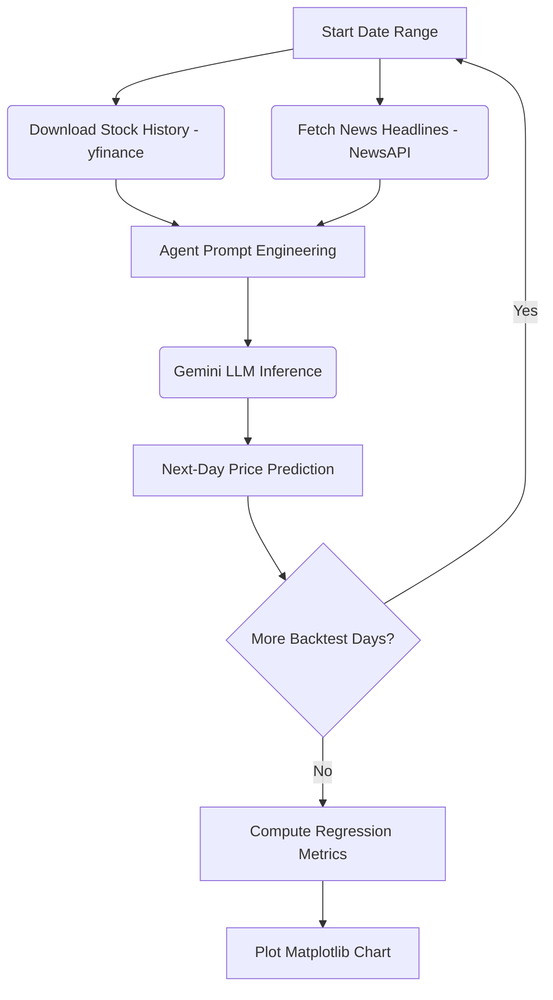

# 🤖 AI Financial Forecasting Agent & Backtesting Engine

An intelligent agentic workflow utilizing Large Language Models (LLMs) to fetch financial news headlines, extract market sentiments, and predict next-day stock closing prices alongside automated backtesting evaluation.

---

## 📈 Key Features

* **Real-time News Sentiment**: Integrates with the **NewsAPI** to retrieve daily market news and sentiment cues relative to target assets.
* **Quantitative History Integration**: Automatically downloads historical pricing data (open, high, low, close, volume) using the **Yahoo Finance (`yfinance`) API**.
* **LLM Reasoning**: Leverages state-of-the-art Generative Models (e.g., `gemini-2.5-flash`) via the Google GenAI SDK to make next-trading-day price predictions.
* **Automated Backtesting Framework**: Evaluates model performance across historical periods, calculating quantitative metrics:
  * Mean Squared Error (MSE)
  * Root Mean Squared Error (RMSE)
  * Mean Absolute Error (MAE)
  * R-squared ($R^2$) Coefficient
  * Non-Dimensional Error Index (NDEI)
* **Performance Visualization**: Plots predicted vs. actual prices dynamically using **Matplotlib** to easily spot trends and volatility gaps.

---

## ⚙️ Architecture Workflow



---

## 🚀 Getting Started

### 📋 Prerequisites
Make sure you have **Python 3.10+** installed on your system.

### 🛠️ Installation

1. **Clone the repository**:
   ```bash
   git clone https://github.com/GURPREETKAURJETHRA/LLM-based-Finance-Agent.git
   cd LLM-based-Finance-Agent
   ```

2. **Install the dependencies**:
   ```bash
   pip install -r requirements.txt
   ```

3. **Configure your API keys**:
   Create a `config.json` file in the root folder of the project. This configures the agent settings and keeps your credentials private:
   ```json
   {
       "news_api_key": "YOUR_NEWS_API_KEY",
       "genai_api_key": "YOUR_GEMINI_API_KEY",
       "model_name": "gemini-2.5-flash",
       "stock_symbol": "RELIANCE.NS",
       "days": 30
   }
   ```
   * 🔑 **`news_api_key`**: Your API key from [newsapi.org](https://newsapi.org/).
   * 🔑 **`genai_api_key`**: Your API key from [Google AI Studio](https://aistudio.google.com/).
   * 🎛️ **`model_name`**: The model to use (we recommend `gemini-2.5-flash` for high speed and low latency).
   * 🏷️ **`stock_symbol`**: Yahoo Finance ticker symbol (e.g. `RELIANCE.NS` for Reliance, `AAPL` for Apple).
   * 📅 **`days`**: Number of historical trading days to include in the context window (default: `30`).

---

## 🏃 Usage

Run the program from your terminal:
```bash
python main.py
```

### What happens when you run it?
1. The agent fetches target stock information and caches the meta details to bypass rate limits.
2. It loops through the requested date range, pulling historical data and corresponding news headlines.
3. Gemini processes the historical data table and news headlines to predict the next closing price.
4. On completion, it prints quantitative error statistics to the console and generates a comparative line chart of **Predicted vs. Actual** prices.

---

## ⚖️ License

Distributed under the MIT License. See `LICENSE` for more information.
