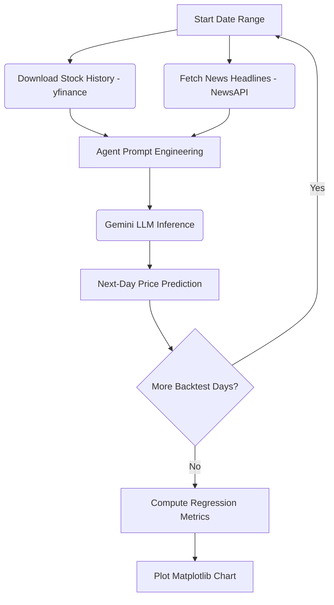

# 🤖 AI Financial Forecasting Agent & Backtesting Engine

An intelligent agentic workflow utilizing Large Language Models (LLMs) to fetch financial news headlines, extract market sentiments, and predict next-day stock closing prices alongside automated backtesting evaluation.

---

## 📈 Key Features

* **Real-time News Sentiment**: Integrates with the **NewsAPI** to retrieve daily market news and sentiment cues relative to target assets.
* **Quantitative History Integration**: Automatically downloads historical pricing data (open, high, low, close, volume) using the **Yahoo Finance (`yfinance`) API**.
* **LLM Reasoning**: Leverages state-of-the-art Generative Models (e.g., `gemini-2.5-flash`) via the Google GenAI SDK to make next-trading-day price predictions.
* **Automated Backtesting Framework**: Evaluates model performance across historical periods, calculating quantitative metrics:
  * Mean Squared Error (MSE)
  * Root Mean Squared Error (RMSE)
  * Mean Absolute Error (MAE)
  * R-squared ($R^2$) Coefficient
  * Non-Dimensional Error Index (NDEI)
* **Performance Visualization**: Plots predicted vs. actual prices dynamically using **Matplotlib** to easily spot trends and volatility gaps.

---

## ⚙️ Architecture Workflow



---

## 🚀 Getting Started

### 📋 Prerequisites
Make sure you have **Python 3.10+** installed on your system.

## Installation

1. Clone the repository:
    ```sh
    git clone https://github.com/GURPREETKAURJETHRA/LLM-based-Finance-Agent.git
    ```
2. Navigate to the project directory:
    ```sh
    cd LLM-based-Finance-Agent
    ```
3. Install the required dependencies:
    ```sh
    pip install -r requirements.txt
    ```

## Configuration

Configure the agent by editing the `config.json` file with your API keys and desired settings:
```json
{
    "news_api_key": "your_news_api_key",
    "genai_api_key": "your_genai_api_key",
    "model_name": "gemini-1.5-pro",
    "stock_symbol": "2330.tw",
    "days": 30
}
```

- `news_api_key`: Your API key for the news data provider (Apply [here](https://newsapi.org/)).
- `genai_api_key`: Your API key for Google Generative AI (Apply [here](https://aistudio.google.com/app/u/1/apikey?hl=zh-tw)).
- `model_name`: The name of the Google Generative AI model to be used.
- `stock_symbol`: The stock symbol to analyze.
- `days`: The number of days to consider for the analysis.

## Usage

1. Ensure that you have configured the config.json file as described in the [Configuration](#configuration) section.

2. Run the project using the following command:
    ```python
    python main.py
    ```


---
## ©️ License 🪪 

Distributed under the MIT License. See `LICENSE` for more information.
